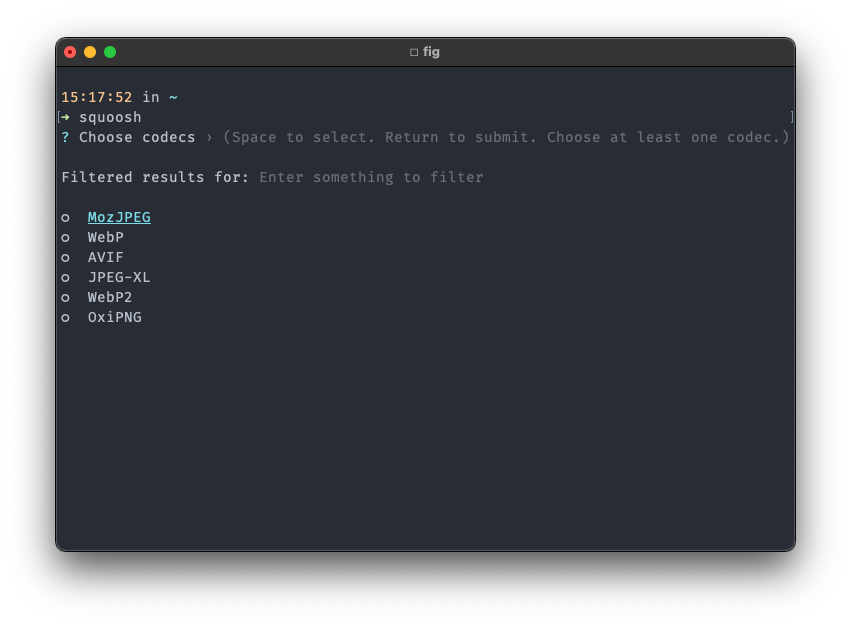

# squoosh-helper

Squoosh-helper is a wrapper around Squoosh that provides a quick selection of codecs without specifying the configuration for every codec.

Configurations for specific codecs are based on the https://squoosh.app/ npx commands.



## Squoosh

[Squoosh](https://github.com/GoogleChromeLabs/squoosh) is an image compression web app that allows you to dive into the advanced options provided by various image compressors.

## ZSH alias

```bash
alias squoosh="node PATH_TO_SQUOOSH_HELPER"
```
